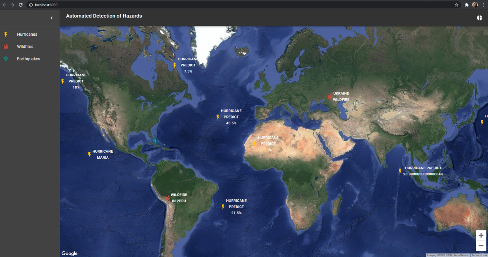
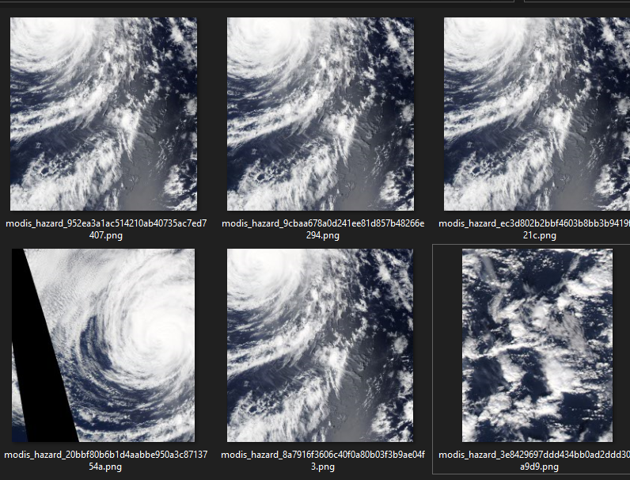
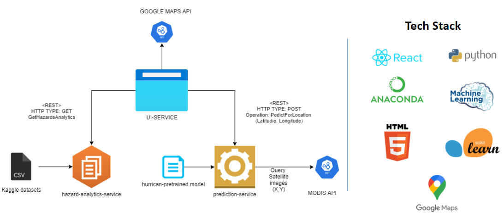

# skyfolks-hazard-prediction-service

## The Web Application



NASA Space Apps Hackathon - 2020

NASA, CSA, CNES, JAXA, and ESA invite you to “Take Action” from home on October 2-4, as part of an entirely virtual celebration of our 9th annual hackathon.

Website: https://2020.spaceappschallenge.org/locations/london

## Model
Building a model using Random Forest

Dataset Overview



Techniques applied:
- Data Clean-up 
- Principal Component Analysis (PCA)
- Random Forest
- XGBoost

## Prediction Service

Implements a REST endpoint that allows prediction with the Random Forest model.

The endpoint is exposed using Flask Framework.

Example to trigger the endpoint with curl.
```
curl -d '{"latitude":-26.055, "longitude":43.273, "predict": [ "hurricane" ]}' -H "Content-Type: application/json" -X POST http://localhost:8777/hazard/predict
````


## The Challenge

Automated Detection of Hazards

Countless phenomena such as floods, fires, and algae blooms routinely impact ecosystems, economies, and human safety. 

Your challenge is to use satellite data to create a machine learning model that detects a specific phenomenon and build an interface that not only displays the detected phenomenon, but also layers it alongside ancillary data to help researchers and decision-makers better understand its impacts and scope.

Our team will be focusing on predicting hurricans.


## The Architecture


##### ui-service

Interactive Web interface build with React and Redux, HTML5 and CSS. Consists of 3 main sections (Menu section, Map sections, Analytics Section). Interactive map using Google Maps API and the satellite view.


#####  hazard-prediction-service

The role of this service is to use call the MODIS APi to get a satellite data in real time from the location selected by the user. After that to apply the Machine Learning model and predict if in the location selected there is an probability to be an Transverse Cirrus Band like hurricane or thunderstorms.


##### hazard-analytics-service

Expose different kind of statistics and events about hazards around the globe. This service is aiming to reuse existing Kaggle datasets and mine insightfull analytics so that are expose in the web application.